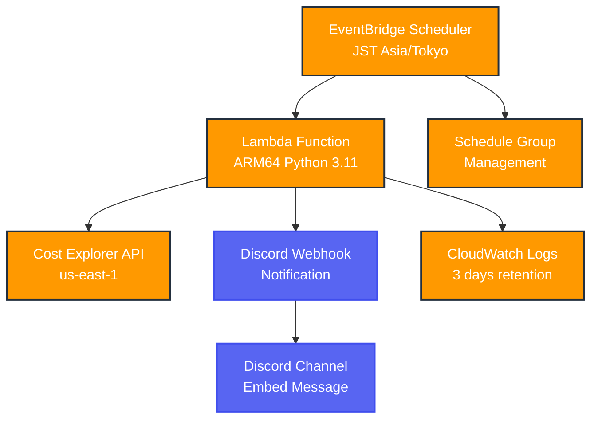

# AWS Cost Notifier for Discord

[](https://terraform.io)
[](https://registry.terraform.io/providers/hashicorp/aws/)
[](https://python.org)
[](https://docs.astral.sh/uv/)

AWS のコストを定期的に取得して Discord に Webhook で通知するサーバレスアプリケーションなのだず。

## 🚀 概要

このプロジェクトは、AWS の利用料金を定期的に監視し、Discord Webhook でチャンネルに通知するシステムです。Terraform を使用した Infrastructure as Code（IaC）で構築され、完全にサーバレスで動作します。

## ✨ 主な特徴

- 🎯 **JST 対応**: EventBridge Scheduler で日本時間での正確な実行
- ⚡ **ARM64 最適化**: コスト効率と性能を両立した Lambda 実行
- 🔧 **uv 高速ビルド**: Rust 製パッケージマネージャーによる高速パッケージング
- 💰 **予算管理**: 月次予算と消化率の自動計算
- 🔐 **セキュア設計**: 最小権限 IAM ロール設計
- 📊 **柔軟な期間設定**: 1-30 日間のコスト取得期間をカスタマイズ可能

## 📋 機能

- ✅ AWS Cost Explorer API を使用したコスト取得（us-east-1 固定）
- ✅ 日次・月次コストの詳細分析と比較
- ✅ Discord Webhook での美しい Embed 通知
- ✅ EventBridge Scheduler による JST 定期実行
- ✅ Terraform による完全な IaC 構成
- ✅ 動的ログレベル制御（DEBUG〜CRITICAL）
- ✅ uv による ARM64 対応パッケージング
- ✅ セキュアな IAM 権限設定

## 🏗️ アーキテクチャ



### 使用する AWS サービス

- **AWS Lambda**: コスト取得と通知処理（Python 3.11 ARM64、128MB、30 秒タイムアウト）
- **EventBridge Scheduler**: JST 対応の定期実行スケジューリング（Asia/Tokyo タイムゾーン）
- **Cost Explorer API**: コストデータの取得（us-east-1 リージョン必須）
- **CloudWatch Logs**: ログ管理と監視（3 日間保持でコスト削減）
- **IAM**: 最小権限でのアクセス制御（Lambda 用、EventBridge Scheduler 用）

## 🛠️ セットアップ

### 前提条件

- AWS CLI 設定済み
- Terraform >= 1.12.2
- Discord Webhook URL
- [uv](https://docs.astral.sh/uv/) パッケージマネージャー

### 1. リポジトリのクローン

```bash
git clone <repository-url>
cd aws-cost-notifier-for-discord
```

### 2. Discord Webhook の設定

1. Discord サーバーで **サーバー設定** → **連携サービス** → **Webhook** を作成
2. Webhook URL をコピー（`https://discord.com/api/webhooks/{id}/{token}` 形式）

### 3. uv のインストール

```bash
# Linux/macOS
curl -LsSf https://astral.sh/uv/install.sh | sh

# Windows (PowerShell)
powershell -c "irm https://astral.sh/uv/install.ps1 | iex"
```

### 4. Terraform 設定

```bash
cd terraform
cp terraform.tfvars.example terraform.tfvars
```

`terraform.tfvars` を編集：

```hcl
aws_region          = "ap-northeast-1"          # 任意のリージョン
environment         = "dev"                     # dev または prod
webhook_url         = "YOUR_DISCORD_WEBHOOK_URL" # 必須：Discord Webhook URL
schedule_expression = "cron(0 0 * * ? *)"      # 毎日 JST 9:00 AM (UTC 0:00)
log_level           = "ERROR"                   # DEBUG,INFO,WARNING,ERROR,CRITICAL
webhook_username    = "AWS料金通知ボット"         # Discord 表示名
webhook_avatar_url  = "https://shared-handson.github.io/icons-factory/aws/Cloud-logo.png"
cost_period_days    = 7                         # 1-30日（コスト取得期間）
budget              = 100                       # 月次予算額（USD）
```

### 5. デプロイ

```bash
# Terraform 初期化
terraform init

# 設定検証
terraform validate
terraform fmt

# デプロイ計画確認
terraform plan

# デプロイ実行
terraform apply
```

## 📊 通知内容

Discord 通知には以下の情報が含まれます：

### Embed 通知内容

- 📅 **期間**: 設定可能な日数（例：過去 7 日間）
- 💸 **日次料金**: 指定期間の合計コスト（USD 表示）
- 📈 **月次料金**: 当月の累計コストと予算消化率
- 📊 **先月比較**: 月跨ぎ時の先月データ
- 🎨 **視覚的な埋め込み**: AWS ブランディング色
- ⚡ **メタデータ**: 生成時刻と Terraform 情報

### 通知例

```
🎯 AWS料金通知 💰

1月25日 から 2月1日 までのAWS利用料金をお知らせします 📊

💸 料金$ : $ 12.34
📅 期間days : 7 days

💹当月料金$/予算$＝消化率% ($切り上げ)
$ 45 / $ 100 = 45.0%

Generated by Terraform ⚡
```

## ⚙️ カスタマイズ

### スケジュール変更（JST 対応）

EventBridge Scheduler は `Asia/Tokyo` タイムゾーンで実行：

```hcl
# 毎日 JST 午前 9時（UTC 0:00）
schedule_expression = "cron(0 0 * * ? *)"

# 毎日 JST 午後 6時（UTC 9:00）
schedule_expression = "cron(0 9 * * ? *)"

# 毎週月曜日 JST 午前 8時
schedule_expression = "cron(0 23 ? * SUN *)"  # 前日夜 UTC

# 毎時（テスト用）
schedule_expression = "cron(0 * * * ? *)"
```

### ログレベル制御

Terraform 変数で Lambda 関数のログレベルを制御：

```hcl
log_level = "DEBUG"    # 詳細なデバッグ情報
log_level = "INFO"     # 一般的な情報
log_level = "WARNING"  # 警告メッセージ
log_level = "ERROR"    # エラーのみ（デフォルト）
log_level = "CRITICAL" # 重大なエラーのみ
```

### コスト取得期間の変更

```hcl
cost_period_days = 1   # 過去 1 日間のコスト
cost_period_days = 7   # 過去 7 日間のコスト（デフォルト）
cost_period_days = 30  # 過去 30 日間のコスト（最大）
```

### 予算設定の変更

```hcl
budget = 10    # 月次予算 $10
budget = 100   # 月次予算 $100
budget = 1000  # 月次予算 $1000
```

## 🔧 開発・テスト

### ローカルテスト

Lambda 関数には直接実行可能なテストコードが含まれています：

```bash
cd lambda
python lambda_function.py
```

### Lambda 関数の手動テスト

AWS Console または AWS CLI でテスト実行：

```bash
aws lambda invoke \
  --function-name aws-cost-notifier-dev \
  --payload '{}' \
  response.json

cat response.json | jq
```

### ログの確認

```bash
# CloudWatch Logs でリアルタイム監視
aws logs tail /aws/lambda/aws-cost-notifier-dev --follow

# EventBridge Scheduler の実行履歴確認
aws scheduler get-schedule \
  --name aws-cost-notification-schedule-dev \
  --group-name aws-cost-notification-group-dev
```

### Lambda パッケージの再ビルド

依存関係を変更した場合：

```bash
terraform apply -replace="null_resource.lambda_dependencies"
```

## 📝 設定変数

| 変数名                | 説明                     | デフォルト          | 必須 | バリデーション   |
| --------------------- | ------------------------ | ------------------- | ---- | ---------------- |
| `aws_region`          | AWS リージョン           | `ap-northeast-1`    | ✅   | -                |
| `environment`         | 環境名                   | `dev`               | ✅   | dev, prod のみ   |
| `webhook_url`         | Discord Webhook URL      | -                   | ✅   | Discord URL 形式 |
| `schedule_expression` | EventBridge スケジュール | `cron(0 0 * * ? *)` | ❌   | rate/cron 形式   |
| `log_level`           | Python ログレベル        | `ERROR`             | ❌   | 標準ログレベル   |
| `webhook_username`    | Discord ユーザー名       | `AWS Notifier`      | ❌   | -                |
| `webhook_avatar_url`  | アバター画像 URL         | AWS Cloud ロゴ URL  | ❌   | -                |
| `cost_period_days`    | コスト取得期間           | `1`                 | ❌   | 1-30 日          |
| `budget`              | 月次予算額（USD）        | `1`                 | ❌   | $1-9999          |

## 🔒 セキュリティ

### IAM ロール設計

- **Lambda 実行用ロール**:
  - Cost Explorer API アクセス権限
  - CloudWatch Logs 書き込み権限のみ
- **EventBridge Scheduler 用ロール**:
  - Lambda 関数実行権限のみ
- Discord Webhook URL は機密変数として管理
- KMS 暗号化を使用せずコスト削減

### セキュリティベストプラクティス

- 最小権限の原則に従った IAM ロール設計
- CloudWatch Logs での実行監視（3 日間保持）
- EventBridge Scheduler による定期実行のみ許可
- Cost Explorer API は us-east-1 リージョンに固定

## 💰 コスト最適化

このシステムは超低コスト運用を実現：

### コスト要因

- **Lambda 実行**: ARM64 で従来比約 20% 削減、月間 $0.005 未満
- **EventBridge Scheduler**: 月間数回の実行で $0.005 未満
- **CloudWatch Logs**: 短期保持（3 日）で $0.005 未満
- **Cost Explorer API**: 月間数回の呼び出しで無料枠内

**月間推定コスト: $0.02 未満**

### 最適化施策

- ARM64 Lambda でコスト効率向上（約 20% 削減）
- uv 高速パッケージングで実行時間短縮
- ログレベル制御でログ量削減（ERROR 以上推奨）
- CloudWatch Logs 短期保持（3 日）でストレージコスト削減
- 最小メモリサイズ（128MB）でコスト最適化

## 🏗️ プロジェクト構成

```
aws-cost-notifier-for-discord/
├── lambda/
│   └── lambda_function.py        # メイン Lambda 関数（Python 3.11）
├── terraform/
│   ├── main.tf                   # メインリソース定義
│   ├── variables.tf              # 変数定義
│   ├── outputs.tf                # 出力定義
│   ├── terraform.tfvars.example  # 変数サンプル
│   ├── lambda_package.zip        # パッケージ済み依存関係（生成）
│   └── lambda_package/           # 依存関係ディレクトリ（生成）
├── pyproject.toml                # Python 依存関係管理
├── uv.lock                       # 依存関係ロックファイル
├── README.md                     # このファイル
├── CLAUDE.md                     # 開発者向け詳細ドキュメント
├── .github/
│   └── README.md                 # 旧 README（参考用）
└── no_terraform.txt              # デプロイスキップ制御（空ファイル）
```

## 🐛 トラブルシューティング

### よくある問題と解決方法

1. **Cost Explorer API エラー**

   - Cost Explorer API は必ず `us-east-1` リージョンでアクセス
   - Lambda 関数は別リージョンでも問題なし

2. **Discord 通知が届かない**

   - Webhook URL の形式確認: `https://discord.com/api/webhooks/{id}/{token}`
   - CloudWatch Logs でエラーの詳細確認

3. **EventBridge Scheduler が実行されない**

   - `Asia/Tokyo` タイムゾーン設定を確認
   - cron 式の書式確認（AWS EventBridge 形式）

4. **uv パッケージングエラー**

   - `aarch64-manylinux2014` プラットフォーム指定を確認
   - Python 3.11 との互換性を確認

5. **Lambda 関数のタイムアウト**
   - 30 秒タイムアウト設定（通常 5-10 秒で完了）
   - Cost Explorer API の応答遅延時は CloudWatch Logs で確認

### ログ確認コマンド

```bash
# Lambda 実行ログ
aws logs describe-log-groups --log-group-name-prefix "/aws/lambda/aws-cost-notifier"
aws logs tail /aws/lambda/aws-cost-notifier-dev --follow

# EventBridge Scheduler 実行履歴
aws scheduler list-schedules --group-name aws-cost-notification-group-dev

# Terraform リソース確認
terraform show
terraform output
```

### デバッグ設定

一時的に詳細ログを有効化：

```hcl
# terraform.tfvars
log_level = "DEBUG"
```

```bash
terraform apply -var="log_level=DEBUG"
```

## 🔧 高度な設定

### 複数環境対応

```bash
# 開発環境デプロイ
terraform workspace new dev
terraform apply -var-file="dev.tfvars"

# 本番環境デプロイ
terraform workspace new prod
terraform apply -var-file="prod.tfvars"
```

### 環境別設定ファイル例

**dev.tfvars**:

```hcl
environment = "dev"
log_level = "DEBUG"
cost_period_days = 1
budget = 10
```

**prod.tfvars**:

```hcl
environment = "prod"
log_level = "ERROR"
cost_period_days = 7
budget = 100
```

### カスタム通知の実装

Lambda 関数をカスタマイズする場合：

- `lambda_function.py` の関数を編集
  - `create_cost_embed()`: Discord Embed のカスタマイズ
  - `get_cost()`: コスト取得ロジックの変更
  - `post_to_discord()`: 送信ロジックの拡張

## 📚 参考資料

- [AWS Cost Explorer API](https://docs.aws.amazon.com/cost-explorer/)
- [Discord Webhooks API](https://discord.com/developers/docs/resources/webhook)
- [Terraform AWS Provider v6.0](https://registry.terraform.io/providers/hashicorp/aws/)
- [EventBridge Scheduler](https://docs.aws.amazon.com/eventbridge/latest/userguide/eb-create-schedule.html)
- [uv Package Manager](https://docs.astral.sh/uv/)
- [AWS Lambda ARM64](https://docs.aws.amazon.com/lambda/latest/dg/foundation-arch.html)

## 🤝 コントリビューション

1. Fork the repository
2. Create your feature branch (`git checkout -b feature/amazing-feature`)
3. Commit your changes (`git commit -m 'Add some amazing feature'`)
4. Push to the branch (`git push origin feature/amazing-feature`)
5. Open a Pull Request

### 開発環境セットアップ

```bash
# uv 環境セットアップ
uv venv
source .venv/bin/activate  # Linux/macOS
# .venv\Scripts\activate   # Windows

# 依存関係インストール
uv sync
uv pip install -e .
```

### 動作テスト

```bash
# Lambda 関数のローカル実行
cd lambda
python lambda_function.py

# Terraform 設定の検証
cd terraform
terraform validate
terraform plan
```

## 📄 ライセンス

このプロジェクトは MIT License の下で公開されています。

---

⚡ **Powered by**: uv + Terraform + AWS Lambda ARM64  
🏗️ **Architecture**: EventBridge Scheduler + Cost Explorer API + Discord Webhook  
💰 **Monthly Cost**: < $0.02 USD  
🚀 **Deploy**: `terraform apply` だけでサーバレス環境が構築完了なのだず！
